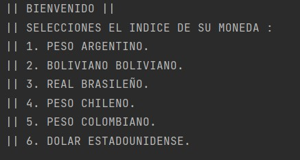
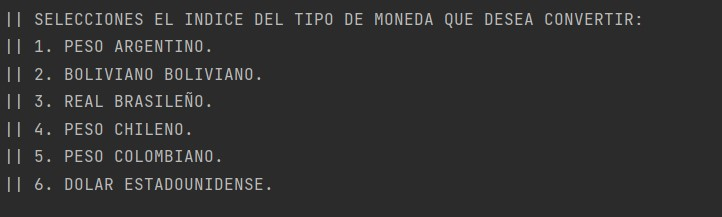
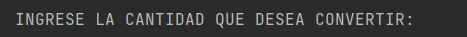
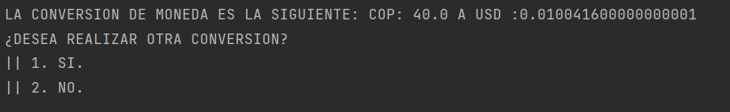
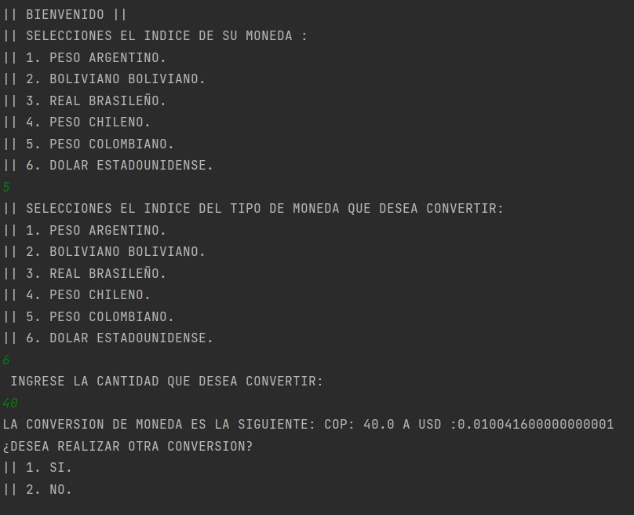

# CONVERSOR DE MONEDAS 

CONVERSOR DE MONEAS, este es un proyecto desarrollado bajo la solicitud del programa ONE: oracle next Education.
Consiste en la creacion de un programa capaz de interactuar con una API y la implementacion de la programación orientada a objetos (POO) para poder facilitar la manera en la que se hace una conversion de moneda.

## Índice

- [Instalación](#instalación)
- [Uso](#uso)
- [Contacto](#contacto)

## Instalación

Instrucciones sobre cómo instalar y configurar el proyecto.

1. Clona utilizando el comando *git clone* el repositorio para poder bajarlo en tu escritorio.
ejemplo: git clone https://github.com/Alexander-O-O/Conversor.git

2. Abre el proyecto en tu IDE de preferencia. 
*se recomienda el uso de InteliJ*

3. Instala Java 17 para poder correr el proyecto.

4. Abre el proyecto en tu IDE y corre el programa.

## Uso

Este programa cuenta con funciones muy sencillas, para las cuales se te presentara a continuacion la manera en la que funciona el programa.

### Selecciona tu tipo de moneda:

En este menu selecciona una de las opciones que se te presentan **colocando el numero de tu tipo de moneda**.

### Selecciona el tipo de divisa para convertir:

En este menu selecciona una de las opciones que se te presentan **colocando el numero del tipo de moneda que deseas**.

### Ingreso de Cantidad:

Aparecera un mensaje indicando que **ingrese el monto** para convertirlo en el tipo de moneda seleccionada.

### ¿Desea continuar?:

Al momento de convertir su moneda **aparecera un mensaje para continuar el programa o terminar de realizar conversiones**.

### FUNCIONAMIENTO COMPLETO DEL PROGRAMA

## Contacto

Ludwing Alexander López Ortiz - @Alexander-O-O - ludwingalexander230@gmail.com

